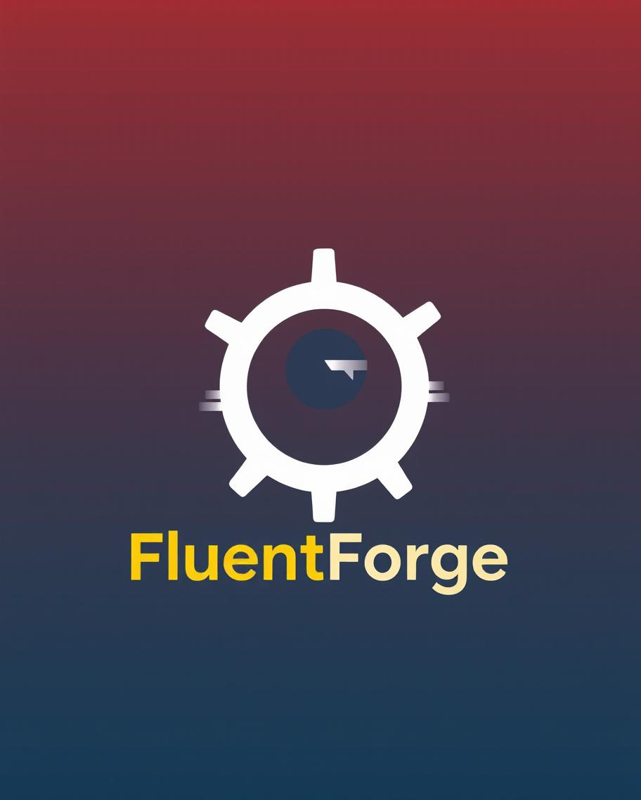

<h1 style="text-align:center;"> FluentForge </h1>
<h4>
    <i style="text-align: center;">
        A multi-tool project that implements a foreign language learning application using non-standard ways of learning in line with modern ways to learn and not forget.
    </i>
</h4>



## Table of Contents

- [Description](#description)
- [Methods](#methods)
- [Requirements](#requirements)
- [Installation](#installation)
- [Usage](#usage)
- [Examples](#examples)
- [License](#license)
- [Database Structure](#database-structure)

## Description

- *FluentForge is a language learning application that offers users an interactive and engaging approach to mastering
  new languages*
- *The project combines a Java-based backend, a React-based frontend, data analysis with Python, and optimization with
  C++.*
- *Users can explore various learning modes such as quizzes, flashcards, simulated conversations, and knowledge tests.*
- *The application tracks user progress and adapts the difficulty level of exercises to provide a personalized learning
  path.*

1. **Key Features to be implemented :**

-[ ] **Interactive Exercises:**
    - Create and complete quizzes, flashcards, and simulated conversations.
-[ ] **Progress Tracking:**
    - Monitor your learning progress and receive personalized recommendations based on your results.
-[ ] **Personalized Tasks:**
    - The app adjusts the difficulty level and types of exercises to match the user’s individual needs.
-[ ] **Multilingual Support:**
    - Learn multiple languages in one place, with the option to add new languages.
-[ ] **Optimization:**
    - With C++ implementation, the application remains fast and efficient, even with large amounts of data.

1. **Technologies Used:**
    * Java: Backend development, database management, and business logic.
    * React: Frontend development, providing a modern and responsive user interface.
    * Python: User progress analysis, generation of personalized exercises and quizzes.
    * C++: Application optimization, ensuring performance and speed.

## Todo Methods and concepts:

Listed implemented methods:

Backend:

-[ ] Database Management
-[ ] Implement Controller Endpoints for Frontend usage
-[ ]

Frontend:

-[ ] Create base application structure
-[ ] Receive backend endpoints
-[ ]

Analisis:

-[ ] Get data from Frontend and analise it based on user application usage
-[ ] Collect received data in graphs and tables
-[ ]

Optimalisation:

-[ ] Optimize memory usage while sending data to frontend
-[ ]

## Requirements

Lista wymaganych narzędzi, bibliotek i innych zależności:
- 

- Java SKD 17
- Python 3.12.2
- React 17.0.1
- C++

## Installation

Instrukcje krok po kroku, jak zainstalować projekt:

1. **Klonowanie repozytorium:**
   ```bash
   git clone https://github.com/Golo258/FluentForge
   cd FluentForge

## Usage

To be written

## Examples

To be written

## License

To be written

## Database Structure

Aprentice table:

| **Table Name**          | **Column Name**       | **Data Type** |                                                  **Constraints** |
|:------------------------|:----------------------|:-------------:|-----------------------------------------------------------------:|
| **apprentice**          | apprenticeId          |    BIGINT     |                                                      PRIMARY KEY |
|                         | username              | VARCHAR(100)  |                                                 NOT NULL, UNIQUE |
|                         | password              | VARCHAR(255)  |                                                         NOT NULL |
|                         | email                 | VARCHAR(255)  |                                                 NOT NULL, UNIQUE |

Language table:

| **Table Name**          | **Column Name**       | **Data Type** |                                                  **Constraints** |
|:------------------------|:----------------------|:-------------:|-----------------------------------------------------------------:|
| **language**            | languageId            |    BIGINT     |                                                      PRIMARY KEY |
|                         | name                  | VARCHAR(100)  |                                                 NOT NULL, UNIQUE |
|                         | additionalInformation |     TEXT      |                                                                  |


Apprentice relationship table with Language:

| **Table Name**          | **Column Name**       | **Data Type** |                                                  **Constraints** |
|:------------------------|:----------------------|:-------------:|-----------------------------------------------------------------:|
| **apprentice_language** | apprenticeId          |    BIGINT     |                                       FOREIGN KEY (apprenticeId) |
|                         | languageId            |    BIGINT     | FOREIGN KEY (languageId), PRIMARY KEY (apprenticeId, languageId) |

Question table:

| **Table Name**          | **Column Name**       | **Data Type** |                                                  **Constraints** |
|:------------------------|:----------------------|:-------------:|-----------------------------------------------------------------:|
| **question**            | questionId            |    BIGINT     |                                                      PRIMARY KEY |
|                         | questionContent       | VARCHAR(100)  |                                                 NOT NULL, UNIQUE |
|                         | possibleResponses     |    TEXT[]     |                                                                  |
|                         | chosenResponse        |  VARCHAR(50)  |                                                         NOT NULL |

Exercise table with its inherited tables

| **Table Name**          | **Column Name**       | **Data Type** |                                                  **Constraints** |
|:------------------------|:----------------------|:-------------:|-----------------------------------------------------------------:|
| **exercise**            | exerciseId            |    BIGINT     |                                                      PRIMARY KEY |
|                         | title                 | VARCHAR(100)  |                                                 NOT NULL, UNIQUE |
|                         | pagination            |   INTEGER[]   |                                                                  |
|                         | apprenticeId          |    BIGINT     |                                       FOREIGN KEY (apprenticeId) |
| **quiz**                | exerciseId            |    BIGINT     |                            PRIMARY KEY, FOREIGN KEY (exerciseId) |
| **flashcard**           | exerciseId            |    BIGINT     |                            PRIMARY KEY, FOREIGN KEY (exerciseId) |
| **knowledge_test**      | exerciseId            |    BIGINT     |                            PRIMARY KEY, FOREIGN KEY (exerciseId) |

### Relationships Overview

| **Relationship**           |   **Type**   |                                    **Details** |
|:---------------------------|:------------:|-----------------------------------------------:|
| apprentice <-> language    | Many-to-Many |                  via apprentice_language table |
| exercise -> quiz           |  One-to-One  |           quiz has a foreign key to exerciseId |
| exercise -> flashcard      |  One-to-One  |      flashcard has a foreign key to exerciseId |
| exercise -> knowledge_test |  One-to-One  | knowledge_test has a foreign key to exerciseId |

